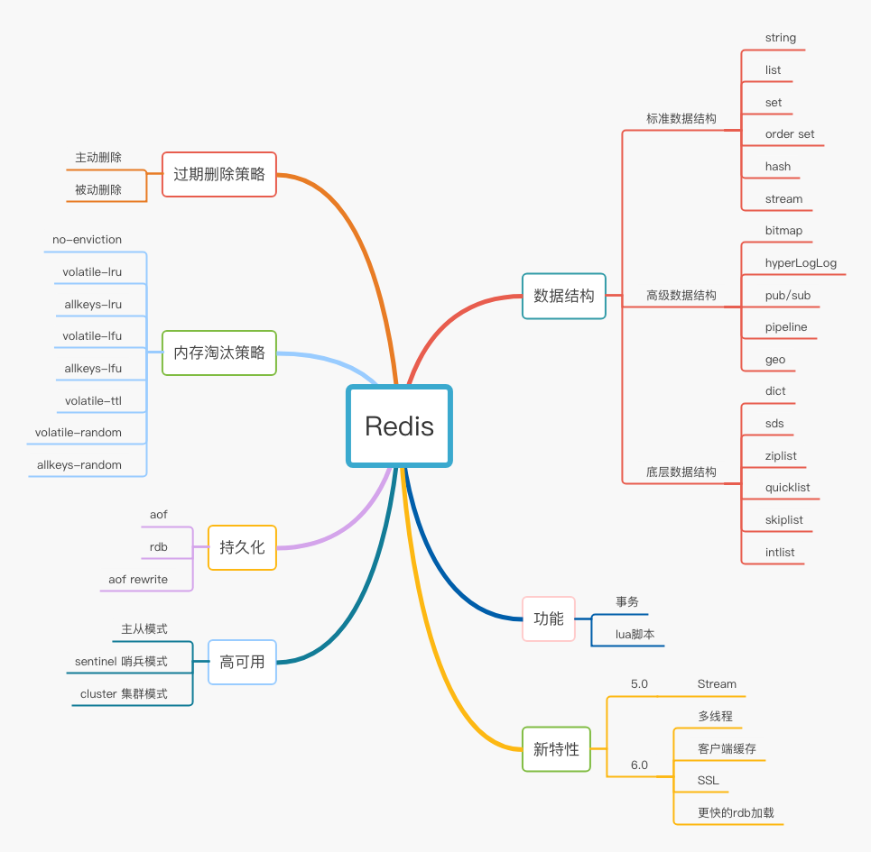

# Redis 篇

首先，看一下Redis的知识图谱。

## 面试问题连环炮

1. Redis是什么？

    1. Redis是一个开源的，可持久化的内存数据结构存储服务，可用作数据库、缓存、消息代理。

    2. 它支持多种数据结构如string，hash，list，set，sorted set，bitmap，stream等。

    3. 它还提供了Redis sentinel、Redis cluster两种高可用架构。
2. Redis 为什么快

    1. 基于内存
    2. 单线程
    3. IO多路复用机制
3. [Redis 的数据类型](../redis/redis-data-type.md)
   1. 基本数据类型：string、hash、list、set、sorted set、stream
   2. 高级数据类型：bitmaps（位图）、HyperLogLogs、Pub/Sub、pipeline、geo
4. [Redis 的底层数据结构](../redis/redis-data-structure.md)

   * sds（动态字符串）
   * dict（字典）
   * skiplist（跳表）
   * ziplist（压缩列表）
   * quicklist（快速列表）
   * intset（整数集合）
   * robj（Redis自定义对象）
5. [Redis 的持久化策略](../redis/redis-persistence.md)

   1. rdb
   2. aof
   3. aof rewrite
6. [Redis 的过期删除策略](../redis/redis-expire-delete.md)
   1. 被动删除
   2. 主动删除
   3. 内存达到maxmemory后按照内存逐出策略进行删除
7. [Redis 的内存逐出策略](../redis/redis-enviction.md)
    1. no-enviction（驱逐）：禁止逐出数据；
    2. allkeys-random：从数据集（server.db[i].dict）中任意选择数据淘汰；
    3. volatile-random：从已设置过期时间的数据集（server.db[i].expires）中任意选择数据淘汰；
    4. volatile-ttl：从已设置过期时间的数据集（server.db[i].expires）中选择将要过期的数据淘汰；
    5. allkeys-lru：对数据集（server.db[i].dict）中的key使用LRU算法淘汰；
    6. volatile-lru：对已设置过期时间的数据集（server.db[i].expires）中的key使用LRU算法淘汰；
    7. allkeys-lfu：对数据集（server.db[i].dict）中的key使用LFU算法进行淘汰；
    8. volatile-lfu：对已设置过期时间的数据集（server.db[i].expires）中的key使用LFU算法进行淘汰。
8. Redis 的qps最高可以达到多少？如何得出的？
9. [Redis 有哪些高可用方案？](../redis/redis-ha.md)
10. [了解哪些一致性hash算法？](../redis/#一致性hash算法)
11. [缓存的三大问题？](../redis/#缓存的三大问题)

## 场景分析

1. 微博场景如何使用Redis来维护用户关系，共同好友，共同关注？
2. 如何实现排行榜top 10？
3. 如何实现点赞功能？