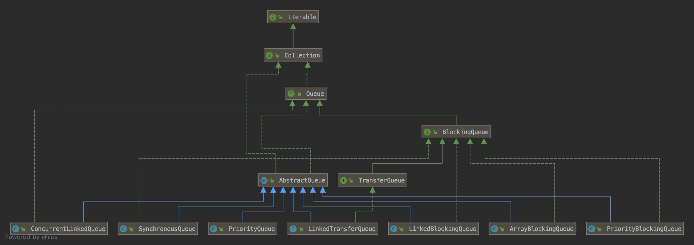
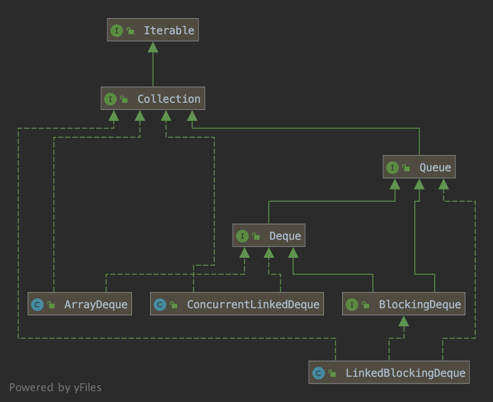

# Java 队列

## 源码分析

### Queue（队列）

#### java.util.PriorityQueue

优先级队列

#### java.util.concurrent.ConcurrentLinkedQueue

线程安全的有界（capacity上限为Integer.MAX_VALUE）非阻塞队列

#### java.util.concurrent.BlockingQueue

阻塞队列父接口

##### java.util.concurrent.ArrayBlockingQueue

使用独占锁实现的有界（初始化队列时，capacity必须指定）阻塞队列（数组实现），其内维护了一个ReentrantLock的实例和两个Condition的条件变量，每次入队、出队、删除、计算size都需要获得lock锁，锁的粒度相对于LinkedBlockingQueue较大。

##### java.util.concurrent.LinkedBlockingQueue

使用独占锁实现的有界（capacity上限为Integer.MAX_VALUE）阻塞队列（链表实现），其内维护了两个ReentrantLock的实例，和对应的Condition条件变量，每次入队需要需要获得putLock锁，每次出队需要获得takeLock锁，每次删除需要同时获得两把锁，锁的粒度相对于ArrayBlockingQueue较小，并发度更高。

##### java.util.concurrent.PriorityBlockingQueue

使用独占锁实现的带优先级的有界（capacity上限为Integer.MAX_VALUE - 8）阻塞队列（数组实现），每次出队都返回优先级最高或者最低的元素，其内是通过最大堆/最小堆实现的，默认通过对象的compareTo方法进行比较，也可通过初始化时传入的Comparator比较器进行比较。

##### java.util.concurrent.DelayQueue

使用独占锁实现的延迟有界（capacity上限为Integer.MAX_VALUE - 8）阻塞队列，其内使用PriorityQueue存放数据，使用一个ReentrantLock实例来实现线程同步，队列中的元素需要实现Delayed接口，而Delayed的接口继承了Comparable接口，这也就满足了使用PriorityQueue队列的前提条件（需要通过compareTo方法比较大小）。

##### java.util.concurrent.SynchronousQueue

使用独占锁实现的同步阻塞队列

###  Deque（双端队列）

#### java.util.ArrayDeque

#### java.util.concurrent.ConcurrentLinkedDeque

#### java.util.concurrent.BlockingDeque

##### java.util.concurrent.LinkedBlockingDeque

## 总结